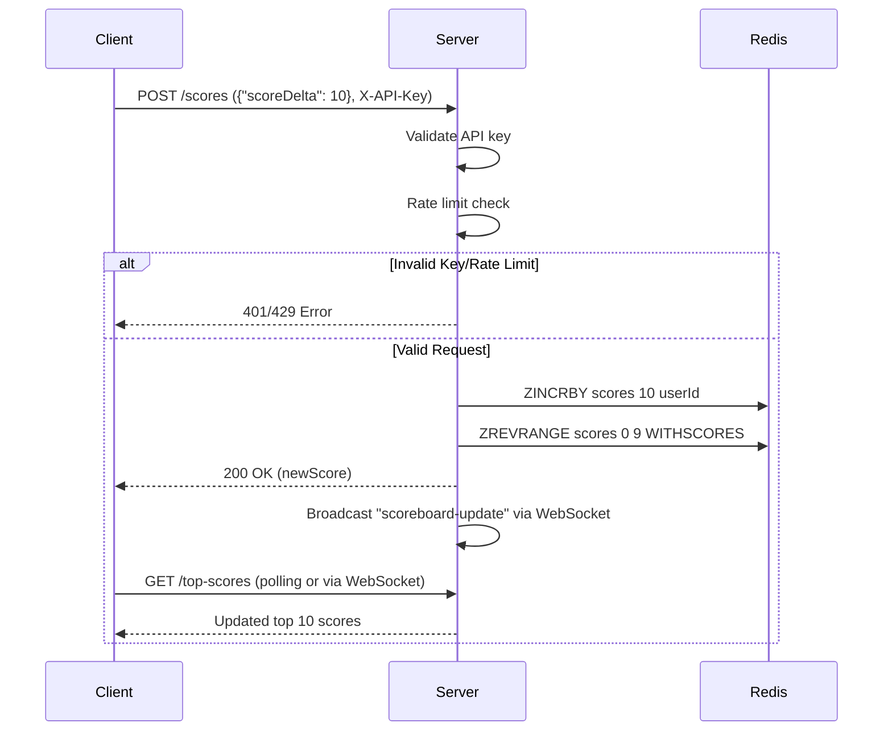

# Problem 6 - Live Scoreboard API Service


## Overview
A backend service for managing a live-updating scoreboard showing the top 10 highest user scores. Features real-time updates, secure score submission, and efficient score storage.

## Features
1. **Score Submission**: Users submit scores via a secure API endpoint.
2. **Real-Time Updates**: Clients receive live scoreboard updates via WebSocket.
3. **Top 10 Scores**: Efficiently fetch and display the top scores. The top scores are stored in a Redis sorted set.
4. **Security**: API key authentication and rate limiting to prevent abuse.

## Architecture
<!--    -->
*[See "Execution Flow" section below for the Mermaid diagram code.]*

## Setup
### Prerequisites
- Runtime (e.g., Node.js, Bun)
- WebSocket server (e.g., Socket.io)
- Cache (e.g., Redis)
- API Gateway (e.g., Express)
- Rate limiter (e.g., express-rate-limit)
- API key manager (e.g., jwt)
- Docker (optional)

## API Endpoints
### Submit Score
- **Method**: `POST`
- **Path**: `/scores`
- **Request Headers**:
  - `X-API-Key`: User's API key.
- **Work Flow**:
    - **Work Flow**:
        1. Validate the user's API key
        2. Perform rate limiting check
        3. Increment the user's score in Redis sorted set
        4. Fetch the updated top scores
        5. Broadcast the updated scores via WebSocket
    - **Request Body**:
    ```json
    {
        "scoreDelta": 10
    }
    ```
- **Response**:
    ```json
    {
        "newScore": 100
    }
    ```

### Get Top Scores
- **Method**: `GET`
- **Path**: `/top-scores`
- **Work Flow**:
    - Fetch the top 10 scores from the Redis sorted set.
    - Return the top scores with user IDs.
- **Response**:
    ```json
    {
        "scores": [
            {
                "userId": "123",
                "score": 100
            },
            {
                "userId": "456",
                "score": 90
            },
            ...
        ]
    }
    ```

### WebSocket Events
- **Event**: `scoreboard-update`
- **Payload**:
    ```json
    {
        "scores": [
            {
                "userId": "123",
                "score": 100
            },
            {
                "userId": "456",
                "score": 90
            },
            ...
        ]
    }
    ```
- **Usage**: Broadcasts the updated top scores to all connected
  WebSocket clients.
  
### Security
- API Key
    - **Validation**: Verify the user's API key.
    - **Rate Limiting**: Prevent abuse by limiting the number of requests.
- WebSocket
    - **Authentication**: Secure WebSocket connections with JWT.
- Input Validation
    - **Score Delta**: Ensure the score delta is a valid number.


## Execution Flow


## Note
- Edge Cases
    - **Duplicate Scores**: Handle cases where multiple users have the same score.
    - **Score Reset**: Implement a mechanism to reset scores periodically.
    - **Error Handling**: Add error handling for API and WebSocket connections.
    - **New User**: Auto-create entries on first score submission.